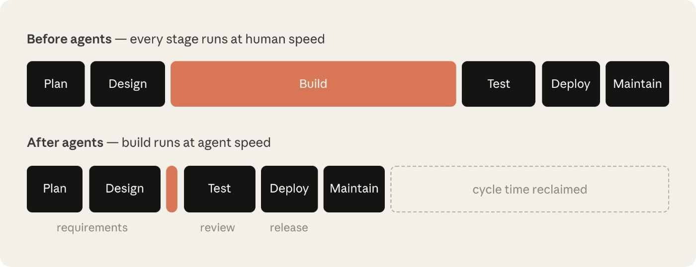
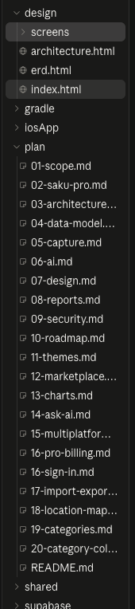
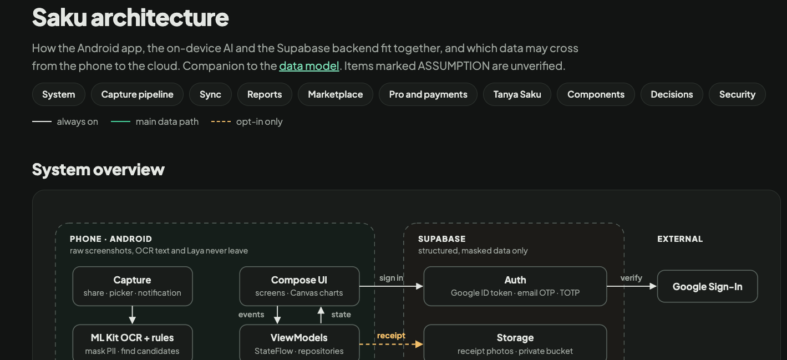
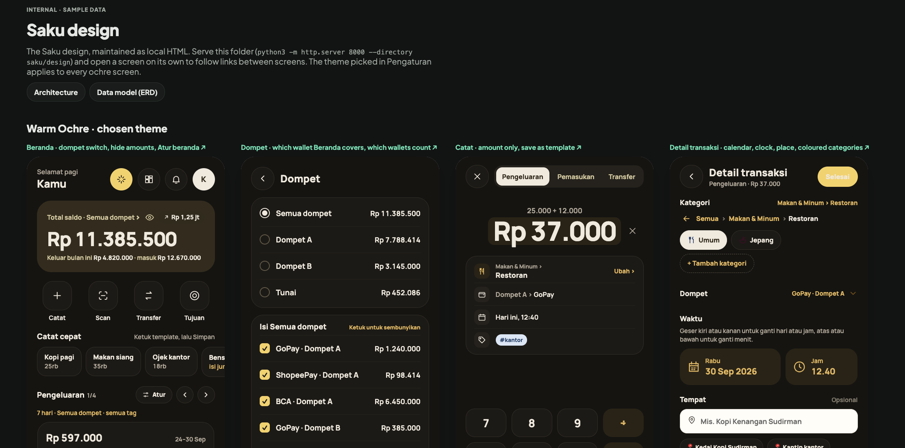

Near the bottom of a file called `IMPLEMENTATION.md`, I found a heading that said "Decisions taken while the owner was away".

I was the owner. I had been away. Under the heading was a short numbered list of choices the agent made without me, and each one said why. I read the whole list in two minutes.

That list is the reason I work in the AI SDLC loop. This post is the short version of that loop.

## Six stages is more than I need



Anthropic published a long guide called [The AI-Native SDLC Playbook](https://claude.com/blog/the-ai-native-sdlc-playbook). Its main point is simple. When an agent can write code in hours, code is no longer the slow part. Planning, testing and review are.

The guide splits the work into six stages. Each stage leaves one file in git, and the next stage reads it. I like that idea a lot. The six stages are more than a side project needs, so I use five stages and a loop.

| Stage | Where it lives | The question it answers |
| --- | --- | --- |
| Plan | `plan/` | What are we building, and when is it done? |
| Design | `design/` | What does it look like, and how is the data shaped? |
| Implement | the code and `IMPLEMENTATION.md` | What was built in each phase? |
| Test | tests named in the plan | How do we know it works? |
| Review | me, reading the diff | Do I agree? |
| Repeat | a new plan file | What did we learn? |

I dropped their deploy and maintain stages on purpose. My project is an experiment with no users, so I have no monitoring loop to show you. If you run a product in production, read those two stages in their guide. They matter. Check the page itself, because it may change.

## Why a native app, and why Kotlin

The project is called Saku. It is a money manager for Android. I built it partly to learn native mobile development.

One reason is the news. In September 2026, Shopify announced that it is moving its mobile apps from React Native back to native Swift and Kotlin. [InfoQ reports](https://www.infoq.com/news/2026/09/shopify-drops-react-native/) that AI coding tools changed the maths for them. In their view, building native apps became faster and cheaper than keeping a layer on top. That is one company, not a rule for every team. But it made me curious enough to try.

I picked Kotlin for two reasons:

- **It is native.** Kotlin is the main language for Android, so the app talks to the platform directly. There is no bridge in the middle.
- **It can go multiplatform.** Kotlin Multiplatform lets me share code with an iPhone app later, and I do not have to give up native screens. I wrote about that in [a separate post](/blog/kotlin-multiplatform-share-the-logic-keep-the-ui).

## Plan: a folder with an index

The `plan/` folder has 22 files. The `README.md` is a table of contents with one line per file. The other files cover scope, architecture, data model, security, reports and a roadmap.

here's the plan files:


Why many small files and not one big document? Claude reads only the file it needs. I can review one topic at a time. And a change shows up as a small diff.

The roadmap has a column I now copy everywhere. It is called "Done when".

| Phase | Deliverable | Done when |
| --- | --- | --- |
| P6 Reports and currency | Annual PDF report, live exchange rates, crypto wallets | The PDF matches the CSV totals for a fixture ledger |

The plan also marks every guess with the word ASSUMPTION. Open questions get a date when they are answered. Later I can search for the guesses, and I know which numbers I should not trust.

## Design: look at it before you build it

Here is the **hint** of app design and architecture:



The `design/` folder has an architecture page, a database diagram, and 33 screen mocks. They are plain HTML files, so I open them in a browser. A change to a mock costs almost nothing. A change to Kotlin costs much more.

Here is how the pieces connect. The file `plan/20-category-colors.md` starts with one line that points to its design, its code and its check.

```markdown
Design: `design/screens/P2CategoryColors.dc.html`.
Code: `ui/theme/CategoryColors.kt`. Checks: `CategoryColorTest`.
```

Below that line, the plan states its idea in one sentence: read your money by colour first, and numbers second. Then it lists five rules. Two of them show why a plan beats a prompt. Green means money in and nothing else. Red is never a category, because red is kept for warnings.

You can argue with a rule like that. You cannot argue with a vibe.

## Implement: one phase at a time

The agent works down the roadmap, one phase at a time. After each phase it adds a row to `IMPLEMENTATION.md` with two columns, what works and which checks cover it. It uses the same words as the plan, so I can lay the two files side by side.

I read this file to learn the state of the project. I do not read the code for that. The file also holds the decisions list from the start of this post. Two of the items are small but typical. One says to start with the first phase and the core of the second. Another says the database schema stays at version 1, because nothing has shipped yet.

None of these choices are big. That is the point. Small choices that nobody writes down are the ones that hurt you three weeks later.

## Test: the plan names the check

Every phase has a "Done when", and every row in `IMPLEMENTATION.md` lists its checks. So the test comes from the plan, not from the code.

Here is one check. Every text colour must have a contrast ratio of at least 4.5 to 1 on its background, in light mode and in dark mode.

```kotlin
private fun ratio(a: Color, b: Color): Double {
    val (hi, lo) = listOf(a.luminance(), b.luminance()).sortedDescending()
    return (hi + 0.05) / (lo + 0.05)
}
```

A database test sits on the other side. It checks that a stranger can see nothing in a shared ledger.

I have one opinion about tests. A test written from the plan checks the idea. A test written after the code often only checks the code. The first kind finds more bugs.

## Review: the one stage I keep

This is the stage I will not hand over. I read plan and design diffs first and closest, because a wrong idea is the most expensive bug. I read the decisions list. I read test names and ask if they match the plan.

Code review still matters, but I do it last. By then the agent has run the build, the lint and the tests. A diff that fails its own checks never reaches me.

## Repeat: a gap becomes a file

The loop is a habit more than a process. When I find a gap, I do not patch it in the code. I write a new plan file, and the loop starts again.

<svg viewBox="0 0 480 250" role="img" aria-labelledby="loop-title" style="width:100%;max-width:480px;height:auto;display:block;margin:1.5rem auto">
<title id="loop-title">The loop: plan, design, implement, test, review. A gap found in review becomes a new plan file.</title>
<defs><marker id="loop-arrow" viewBox="0 0 10 10" refX="9" refY="5" markerWidth="7" markerHeight="7" orient="auto-start-reverse"><path d="M0 0 L10 5 L0 10 z" style="fill:var(--color-accent)"/></marker></defs>
<g style="fill:var(--color-surface-elevated);stroke:var(--color-border);stroke-width:1.5">
<rect x="10" y="20" width="130" height="46" rx="8"/>
<rect x="175" y="20" width="130" height="46" rx="8"/>
<rect x="340" y="20" width="130" height="46" rx="8"/>
<rect x="340" y="170" width="130" height="46" rx="8"/>
<rect x="175" y="170" width="130" height="46" rx="8" style="stroke:var(--color-accent)"/>
</g>
<g style="fill:var(--color-heading);font-family:var(--font-mono);font-size:15px;text-anchor:middle">
<text x="75" y="48">Plan</text>
<text x="240" y="48">Design</text>
<text x="405" y="48">Implement</text>
<text x="405" y="198">Test</text>
<text x="240" y="198">Review</text>
</g>
<g style="fill:none;stroke:var(--color-accent);stroke-width:1.5">
<path d="M140 43 H173" marker-end="url(#loop-arrow)"/>
<path d="M305 43 H338" marker-end="url(#loop-arrow)"/>
<path d="M405 66 V168" marker-end="url(#loop-arrow)"/>
<path d="M340 193 H307" marker-end="url(#loop-arrow)"/>
<path d="M175 193 H75 V68" marker-end="url(#loop-arrow)"/>
</g>
<g style="fill:var(--color-text-secondary);font-family:var(--font-mono);font-size:12px">
<text x="88" y="125">gap found:</text>
<text x="88" y="142">new plan file</text>
</g>
</svg>

The location feature is a good example. It started as `plan/18-location-map.md`. Then it got a design screen, `P2EntryLocation.dc.html`, and a database test, `locations_test.sql`. Last came a new section in `IMPLEMENTATION.md`. Category nature went the same way, with `plan/19-categories.md` and a small migration.

One commit holds the plan, the design, the code and the check together. The same commit also touched four older plan files with small edits. That is how I keep plans from going stale. When the code changes, the plan changes in the same commit.

## What I would tell a team

- Start with one folder and one index file. Do not start with a template system.
- Make every plan file name its design, its code and its check.
- Put a "Done when" next to every phase.
- Write guesses as ASSUMPTION, so you can find them later.
- Keep a human at review, and point that human at plan and design diffs first.
- Keep secrets out of the plan folder. In Saku, the `.gitignore` blocks `.env` files and Google client secret files, so they never reach the repo.

The loop will feel slow for the first day. After that, you stop re-explaining the project in every chat. The files do it for you.
